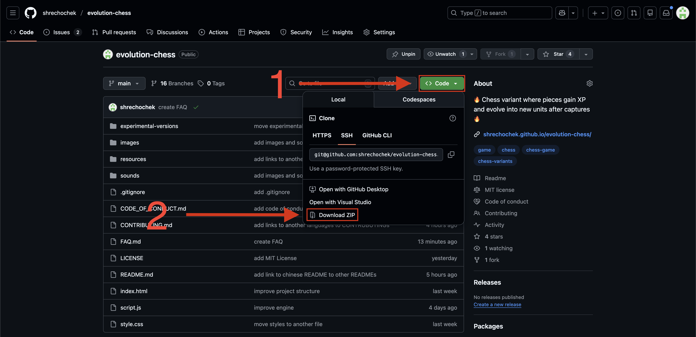

# FAQ

## Contents
- [🛠 Installation](#installation)
- [🧑‍🤝‍🧑 Contributing](CONTRIBUTING.md)

---

<h2 id="installation">🛠 Installation</h2>

### How to download?

1. open terminal 
2. run this commands in your terminal

**linux/macos:**
> ```bash
> git clone https://github.com/shrechochek/evolution-chess
> cd evolution-chess
> open index.html
> ```

**windows:**
> ```bash
> git clone https://github.com/shrechochek/evolution-chess
> cd evolution-chess
> start index.html
> ```

### What should i do if first method doesn't work?

1. download repository



2. open downloads on your PC
3. double click `index.html`