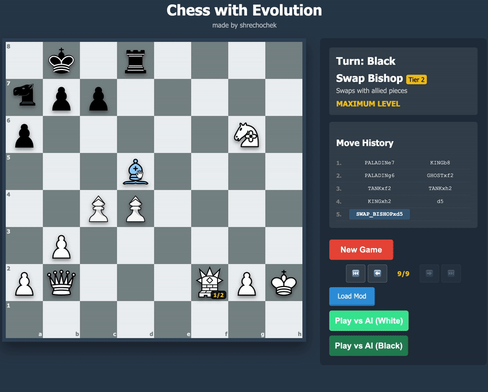

# Evolution Chess
> Evolution Chess is a chess variant where pieces gain XP and evolve into new units after captures

---

> [!IMPORTANT]
>  🌍 **Languages**  
>  🇺🇸(en)  |  [🇷🇺(ru)](../resources/READMEs/ru/README.md)  |  [🇺🇦(ua)](../resources/READMEs/ua/README.md)| [🇨🇳(zh)](../resources/READMEs/zh/README.md)

---

## Contents
- 🎮 [How to play](#how-to-play)
- 🏙 [Game example](#game-example)
- 🌈 [How pieces evolve](#how-pieces-evolve)
- 🗂 [How to create mods](#how-to-create-mods)
- 🧭 [Roadmap](#roadmap)
- ⚠️ [Known Limitations](#known-limitations)
- 🧑‍💻 [Authors](#authors)
- ⚙️ [Engine](#engine)
- 🛠 [Tech stack](#tech-stack)
- ❓ [FAQ](FAQ.md)

---

<h2 id="how-to-play">🎮 How to Play</h2>
You can play Evolution Chess in two ways:

1. 🌐 [**Play online**](https://shrechochek.github.io/evolution-chess/)
2. 💻 Download repository and run on your own PC

> [!NOTE]
> You can play against your friends or AI

---

<h2 id="game-example">🏙 Game Example</h2>


📸 More screenshots: [here](../resources/images/game-images)

---

<h2 id="how-pieces-evolve">🌈 How Pieces Evolve</h2>
When a piece captures another piece, it gains experience and can evolve into a new piece

[**Evolution tree**](https://miro.com/app/board/uXjVI-ZUrws=/)

---

<h2 id="how-to-create-mods">🗂 How to Create Mods</h2>

### 1. Create a mod folder
Create a folder with `.json` file

### 2. Add images
If you use custom images:
- upload them to the `/images` folder inside your mod (**recommended**)
- or place them directly in the mod folder


### 3. Set symbols for pieces
```json
"SYMBOLS": {
  "pawn": "pawn",
  "king": "king",
  "rook": "rook",
  "knight": "knight",
  "bishop": "bishop",
  "queen": "queen",
  "spearman": "spearman",
  "star": "star"
},
```

### 4. Describe pieces information
```json
"PIECE_TYPES": {
  "pawn": { 
    "name": "spearman", 
    "symbol": "spearman", 
    "desc": "pawn that attacks the square directly ahead",
    "role": "pawn", 
    "tier": 1, 
    "xpReq": 1,
    "special": "spear_attack"
  }
}
```

- **`name`** — display name of the piece
- **`symbol`** — symbol defined in `SYMBOLS`
- **`desc`** — description of the piece
- **`role`** — special role:
  - `king` — can castle, losing all kings means defeat
  - `pawn` — can promote, en passant enabled
  - `rook` — participates in castling
- **`tier`** — evolution tier
- **`xpReq`** — XP required to evolve (`-1` = no evolution)
- **`special`** - special ability
  - `spear_attack` - attack square ahead
  - `revenge` - destroy the piece that captured it
  - `teleport` - teleport to every square without piece on it
  - `explode_n` - destroy everything within radius n, when this piece captured or capture
  - `detonate_n` - destroy everything within radius n, when this piece capture or captured, except pawns and kings
  - `explode_all_n` - destroy everything within radius n, when this piece captured or capture
  - `range_capture` - capture without moving
  - `swap_ally` - swap places with same color piece
- **`ghost`** - can go through n pieces (you must set n)
- **`immortal`** - cannot be captured

> [!WARNING]
> You should rewrite all standard pieces logic

> [!TIP]
> Standard pieces logic is already described in test mode you can use it

### 5. Write down evolution tree
```json
"EVOLUTION_TREE": {
  "pawn": ["star"],
  "mutant": [],
  "king": [],
  "rook": [],
  "knight": [],
  "bishop": [],
  "queen": []
}
```

> [!NOTE]
> In this evolution tree pawn can evolve into star

### Final `.json` structure
```json
{
  "SYMBOLS": {...},
  "PIECE_TYPES": {...},
  "EVOLUTION_TREE": {...}
}
```

### Final mod structure
```text
mod/
 ├── images/
 └── mod.json
```

> [!NOTE]
> If you still don't understand how to create mods or want to see a specific example you can check <br>
> [`mod example`](../resources/mods/mod_example)

---

<h2 id="roadmap">🧭 Roadmap</h2>

- [x] Playable alpha
- [x] 2 layers of evolution
- [x] Mods support
- [x] Adaptive engine
- [x] Better UI for phones
- [x] Better engine
- [ ] Better control from phone
- [ ] Multiplayer website

---

<h2 id="known-limitations">⚠️ Known Limitations</h2>

- Visual bugs may appear
- Control is not polished

---

<h2 id="engine">⚙️ Engine</h2>

The game uses a custom-built engine

The engine is designed to support custom pieces and evolution mechanics

The engine plays at approximately 1300 ELO

The engine is using minimax, alpha–beta pruning and moves sorting

---

<h2 id="tech-stack">🛠 Tech Stack</h2>


- **Frontend:** HTML, CSS, JavaScript
- **Game Engine:** Custom chess engine (JavaScript)
- **Modding:** JSON-based mod system
- **Deployment:** GitHub Pages

---

<h2 id="authors">🧑‍💻 Authors </h2>
  
- 🧑‍💻 **Programmer**: [_shrechochek_](https://github.com/shrechochek)
- 🎨 **Artist**: [_Serebr1k_](https://github.com/Serebr1k-code)
