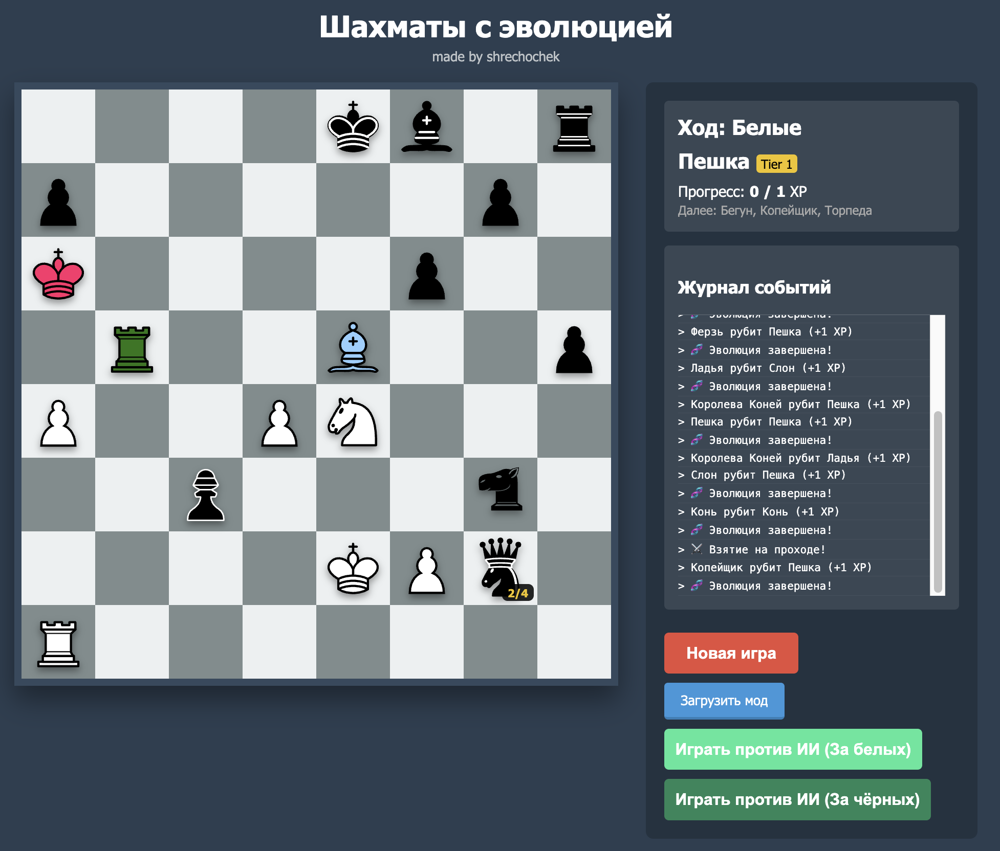
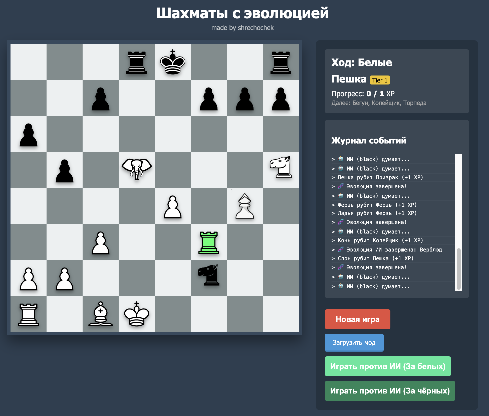

# chess where pieces can evolve

## contents
- [contents](#contents)
- [how to play?](#how-to-play)
- [how pieces evolve?](#how-pieces-evolve)
- [how to create mods?](#how-to-create-mods)
- [screenshots from game](#game-example)
- [authors](#authors)

## how to play
### you can [ play online ](https://shrechochek.github.io/evolution-chess/) or you can download respository and run site on your own pc


## game example
<!-- 
<!-- 
 -->


## how pieces evolve
### when piece eat another piece first piece can evolve into another piece
### you can see evolution tree [ here ](https://miro.com/app/board/uXjVI-ZUrws=/)

## how to create mods
1. ### first of all you must create folder with .json file
2. ### if you use photos that are not in original respository you should upload them to /images folder in your mod(recommended) or upload them directly into mod folder
3. ### then you must set name for photos that you use

> ```json
> "SYMBOLS": {
>     "pawn": "pawn",
>     "king": "king",
>     "rook": "rook",
>     "knight": "knight",
>     "bishop": "bishop",
>     "queen": "queen",
>     "spearman": "spearman",
>     "star": "star"
> },
> ```

4. ### after that you must write information about pieces
> ```json
> "pawn": { 
>       "name": "копейщик", 
>       "symbol": "spearman", 
>       "desc": "пешка, которая бьет клетку перд собой",
>       "role": "pawn", 
>       "tier": 1, 
>       "xpReq": 1,
>       "special": "spear_attack"
> },
> ```
> * ### "name" you can write name of figure
> * ### "symbol" you can use one of symbols, that you set earlier
> * ### "desc" you can write a description of figure
> * ### "role" you can set special role for you figure
> > 1. king - (can castle, if you have 0 kings you lose, can not be blown)
> > 2. pawn - (can be promoted, can not be blown, can eat en passant)
> > 3. rook - (can participate in castling)
> * ### "tier" you can set a tier of figure
> * ### "xpReq" you can set how much xp it requiers to evolve (use 999 if figure should not evolve)
> * ### "special" you can set special ability of figure
> > 1. spear_attack - (figure can capture piece ahead)
> > 2. revenge - (if piece is captured it destroy piece that captured it)
> > 3. teleport - (piece can teleport to every square of board if square is not occupied with another figure)
> > 4. explode_n - (destroy everything within radius n, when this piece capture or captured, expect pawns and kings)
> > 5. detonate_n - (destroy everything within radius n, when this piece captured, expect pawns and kings)
> > 6. range_capture - (figure can capture without moving)
> > 7. explode_all_n - (destroy everything within radius n, when this piece captured or capture)
> > 8. swap_ally - (piece can change places with another figure of its color)
> * ### "ghost" you can set how much pieces your figure can go through
> * ### "immortal" you can make your pieces immortal

> [!WARNING]
> you should rewrite all standart pieces logic

> [!TIP]
> standart pieces logic is already described in test mode you can use it

5. ### and finally you must write the evolution tree
> ```json
> "EVOLUTION_TREE": {
>     "pawn": ["star"],
>     "mutant": [],
>     "king": [],
>     "rook": [],
>     "knight": [],
>     "bishop": [],
>     "queen": []
>   }
> ```
> ### in this evolution tree pawn can evolve into star

### your final mod structure should look like this
> ```json
> {
>     "SYMBOLS": {
>     
>     },
>     "PIECE_TYPES": {
>     
>     }
>     "EVOLUTION_TREE": {
>     
>     }
> }
> ```

##### **if you still don't understand how to create mods or want to see a specific example you can check /evolution-chess-2-alfa/mod_example folder**

## authors
Programmer: [_shrechochek_](https://github.com/shrechochek)

Artist: [_Serebr1k_](https://github.com/Serebr1k-code)
